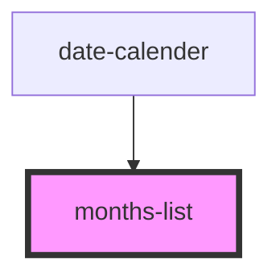

# months-list

<!-- Auto Generated Below -->

## Properties

| Property            | Attribute             | Description | Type  | Default     |
| ------------------- | --------------------- | ----------- | ----- | ----------- |
| `currentTime`       | `current-time`        |             | `any` | `undefined` |
| `dateFormat`        | `date-format`         |             | `any` | `undefined` |
| `handleMonthChange` | `handle-month-change` |             | `any` | `undefined` |
| `maxDate`           | `max-date`            |             | `any` | `undefined` |
| `minDate`           | `min-date`            |             | `any` | `undefined` |
| `selectedDate`      | `selected-date`       |             | `any` | `undefined` |

## Dependencies

### Used by

 - [date-calender](../date-calender)

### Graph

----------------------------------------------

*Built with [StencilJS](https://stenciljs.com/)*
